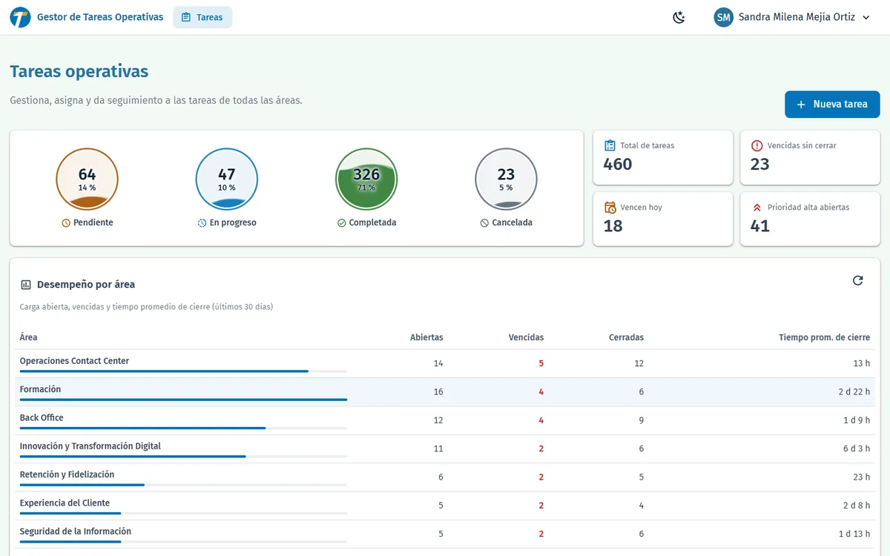
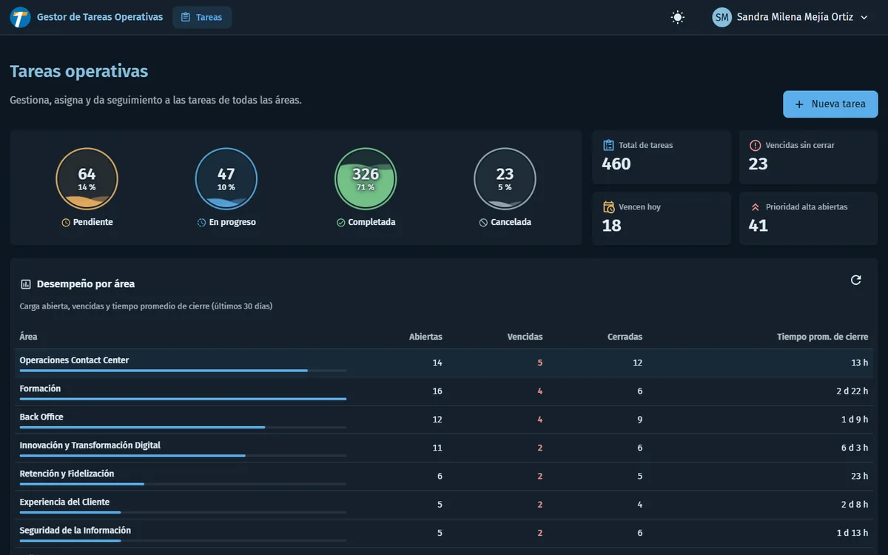
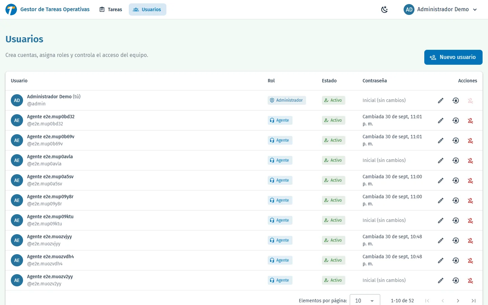
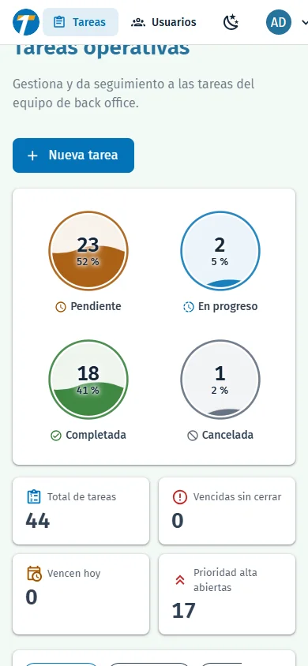

# Gestor de Tareas Operativas

Aplicación fullstack para gestionar las tareas operativas de un equipo de **back office** (BPO / contact center):
los agentes inician sesión, ven las tareas con filtro por estado y paginación, crean tareas nuevas y cambian su estado.
Cada cambio queda registrado en un historial de auditoría. Las tareas se **asignan a responsables**: cada agente
solo ve las suyas y el administrador ve y gestiona todas. Incluye panel de indicadores, administración de
usuarios con roles (`ADMIN` / `AGENT`), cambio de contraseña propio y modo claro/oscuro.

**Stack:** Vue 3 (Composition API) + Vuetify · Node.js + Express + TypeScript · SQL Server 2022 · Docker Compose · Linux

| Login | Tareas e indicadores | Modo oscuro |
|---|---|---|
|  |  |  |

| Administración de usuarios | Móvil |
|---|---|
|  |  |

---

## Contenido

1. [Ejecución en Linux](#1-ejecución-en-linux)
2. [Arquitectura](#2-arquitectura)
3. [Base de datos](#3-base-de-datos)
4. [API REST](#4-api-rest)
5. [Frontend](#5-frontend)
6. [Seguridad](#6-seguridad)
7. [Pruebas](#7-pruebas)
8. [Desarrollo local sin Docker](#8-desarrollo-local-sin-docker)
9. [Respuestas a las preguntas](#9-respuestas-a-las-preguntas)

---

## 1. Ejecución en Linux

### Requisitos

- Docker Engine 24+ con el plugin **Docker Compose v2** (`docker compose version`).
- CPU **x86_64** y al menos **2 GB de RAM libres** (requisito de SQL Server).
  En ARM (Apple Silicon, Raspberry Pi) la imagen de SQL Server corre emulada y arranca más lento.
- Puerto **8080** libre (configurable con `FRONTEND_PORT`).

### Pasos

```bash
git clone https://github.com/Rolo0317/prueba_tecnica_bpo_fastco.git
cd prueba_tecnica_bpo_fastco

# 1. Variables de entorno (plantilla documentada, sin secretos reales)
cp .env.example .env
#    Opcional pero recomendado: reemplazar los valores "cambiar_..." de .env, por ejemplo:
#    sed -i "s|^JWT_SECRET=.*|JWT_SECRET=$(openssl rand -base64 48)|" .env

# 2. Levantar todo (base de datos, inicialización, API y frontend)
docker compose up --build -d

# 3. Verificar que todo quedó sano (db-init termina con "Exited (0)", es normal)
docker compose ps
```

Abrir **http://localhost:8080** e iniciar sesión con el usuario demo definido en `.env`
(`SEED_ADMIN_USERNAME` / `SEED_ADMIN_PASSWORD`; con la plantilla: `admin` / `cambiar_Admin123!`).

El primer arranque tarda 1–2 minutos (descarga de imágenes y arranque de SQL Server).

### Qué ocurre al ejecutar `docker compose up`

```
db (SQL Server) ──healthy──▶ db-init (crea BD, tablas, índices, SPs, catálogos y usuario de app; termina)
                                  │ completed_successfully
                                  ▼
                             backend (API) ──healthy──▶ frontend (nginx :8080)
```

1. **db**: SQL Server 2022 con volumen persistente y healthcheck.
2. **db-init**: ejecuta en orden los scripts de `db/scripts` con `sqlcmd`. Son **idempotentes**: se ejecutan en cada arranque sin duplicar nada.
3. **backend**: la API se conecta con un **usuario de mínimo privilegio** (nunca SA) y crea el usuario demo (contraseña con bcrypt) y 12 tareas de ejemplo si la tabla está vacía (`SEED_SAMPLE_TASKS`).
4. **frontend**: nginx sirve la aplicación y hace de proxy de `/api` hacia la API.

Solo se publica el puerto del frontend: la base de datos y la API quedan en la red interna de Docker.

### Comandos útiles

| Acción | Comando |
|---|---|
| Ver logs | `docker compose logs -f backend` |
| Detener (conserva los datos) | `docker compose down` |
| Reiniciar desde cero (borra la BD) | `docker compose down -v && docker compose up --build -d` |
| Probar la API | ver [ejemplos con curl](#ejemplos-con-curl) |

---

## 2. Arquitectura

```
db/            Scripts SQL numerados (idempotentes) + script de inicialización
backend/       API REST · Express 5 + TypeScript · patrón MVC por módulos
frontend/      SPA · Vue 3 + Vuetify 4 · patrón MVVM por módulos · nginx
e2e/           Pruebas end-to-end (Playwright) contra el entorno de Docker
docs/adr/      Decisiones de arquitectura
docker-compose.yml · .env.example
```

### Backend — MVC por capas, modular por funcionalidad

```
routes → controller → service → repository → Stored Procedure
```

| Capa | Responsabilidad | Ejemplo |
|---|---|---|
| Routes | Rutas, middlewares y validación | `task.routes.ts` |
| Controller | Solo HTTP: lee la petición validada y responde | `task.controller.ts` |
| Service | Casos de uso | `task.service.ts` |
| Repository (Model) | Ejecuta SPs con parámetros tipados | `task.repository.ts` |
| Mapper (View) | Forma del JSON de respuesta | `task.mapper.ts` |

- `container.ts` es el *composition root*: único lugar donde se crean las implementaciones concretas (inyección de dependencias → todo es testeable sin base de datos).
- `database/procedure-executor.ts` es el **único punto** que habla con SQL Server.
- `config/env.ts` valida todas las variables de entorno con zod al iniciar; si falta algo, la API no arranca.

### Frontend — MVVM

| Capa | Responsabilidad | Ejemplo |
|---|---|---|
| Model | Llamadas HTTP tipadas | `services/taskService.ts` |
| ViewModel | Estado reactivo, carga, errores, acciones | `composables/useTasks.ts` |
| View | Solo presentación | `components/TaskTable.vue` |

Las decisiones y sus alternativas están en [docs/adr/0001-arquitectura-general.md](docs/adr/0001-arquitectura-general.md)
y [docs/adr/0002-control-de-acceso-y-eliminacion-de-usuarios.md](docs/adr/0002-control-de-acceso-y-eliminacion-de-usuarios.md).

### Permisos por rol

| Acción | Administrador | Agente |
|---|---|---|
| Ver tareas e indicadores | Todas | Solo las asignadas a él y las que él creó |
| Crear tareas | Sí, eligiendo responsable | Sí; quedan asignadas a él |
| Editar título, descripción, prioridad y fecha | Cualquier tarea | Solo las que él creó |
| Asignar / reasignar responsable | Sí | No |
| Cambiar estado | Cualquier tarea | Las que puede ver |
| Administrar usuarios (crear, editar, desactivar, eliminar, restablecer contraseña) | Sí | No |
| Cambiar su propia contraseña | Sí | Sí |

La visibilidad se aplica en la API **y** en los Stored Procedures (defensa en profundidad). Una tarea que el
agente no puede ver responde 404, para no revelar que existe.

---

## 3. Base de datos

Detalle completo, modelo y evidencia del índice en [db/README.md](db/README.md).

| Script | Contenido |
|---|---|
| `01_database.sql` | Base de datos + `READ_COMMITTED_SNAPSHOT` (las lecturas no bloquean escrituras) |
| `02_tables.sql` | `Tasks`, `TaskStatuses`, `TaskStatusTransitions`, `Users`, `TaskStatusHistory` |
| `03_indexes.sql` | Índices justificados por las consultas reales |
| `04_views.sql` | `vw_TaskDetails`: proyección única que reutilizan todos los SPs |
| `05_procedures.sql` | Stored Procedures de tareas y estados |
| `05_procedures_users.sql` | Stored Procedures de usuarios (login, administración, contraseñas) |
| `05_procedures_stats.sql` | Estadísticas para los indicadores |
| `06_seed_catalogs.sql` | Estados y transiciones permitidas |
| `07_security.sql` | Usuario de aplicación con permiso **solo de EXECUTE** |

**Stored Procedures:** todos con `SET NOCOUNT ON`, `SET XACT_ABORT ON` y `TRY/CATCH` (`ROLLBACK` + `THROW`).

| SP | Transacción | Qué hace |
|---|---|---|
| `usp_Tasks_List` | — | Filtro opcional por estado + paginación `OFFSET/FETCH` + total (`OUTPUT`) |
| `usp_Tasks_Create` | ✅ | Crea la tarea en `PENDING` (con responsable opcional) y registra el historial |
| `usp_Tasks_Update` | ✅ | Edita datos y responsable; un agente solo edita lo que creó y no reasigna (50403) |
| `usp_Tasks_ChangeStatus` | ✅ | Bloquea la fila (`UPDLOCK`), valida existencia y transición, actualiza e inserta historial |
| `usp_TaskStatuses_List` | — | Catálogo de estados con sus transiciones permitidas |
| `usp_Tasks_Stats` | — | Conteo por estado (incluye estados en 0), vencidas, que vencen hoy y alta prioridad abiertas |
| `usp_Users_GetByUsername` / `usp_Users_GetCredentialsById` | — | Login y verificación de la contraseña actual (solo usuarios activos) |
| `usp_Users_List` / `usp_Users_Create` | — | Listado paginado y alta (solo acepta hashes bcrypt) |
| `usp_Users_Update` / `usp_Users_SetActive` | ✅ | Edición y activación con reglas: nadie se desactiva ni se quita el rol a sí mismo y siempre queda un administrador activo (conteo con `UPDLOCK, HOLDLOCK` contra condiciones de carrera) |
| `usp_Users_UpdatePassword` | — | Cambio o restablecimiento de contraseña (registra `PasswordChangedAt`) |

**Reglas de negocio en datos:** las transiciones permitidas están en la tabla `TaskStatusTransitions`
(`Pendiente → En progreso | Cancelada`, `En progreso → Pendiente | Completada | Cancelada`; `Completada` y `Cancelada` son finales).
El SP las valida y el frontend las lee de la API: la regla existe en un solo lugar.

Los errores de negocio se lanzan con `THROW 50400 | 50404 | 50409` y la API los traduce a HTTP 400 / 404 / 409.

---

## 4. API REST

Base: `/api/v1`. Todas las rutas de tareas requieren `Authorization: Bearer <token>`.

| Método | Ruta | Éxito | Errores |
|---|---|---|---|
| `POST` | `/auth/login` | 200 `{ token, tokenType, expiresIn, user }` | 400 · 401 · 429 |
| `GET` | `/tasks?status=&page=&pageSize=` | 200 `{ data, pagination }` | 400 · 401 |
| `POST` | `/tasks` | 201 + cabecera `Location` | 400 · 401 |
| `PATCH` | `/tasks/:id` (editar; `assignedTo` solo ADMIN) | 200 | 400 · 401 · 403 · 404 |
| `PATCH` | `/tasks/:id/status` | 200 | 400 · 401 · 404 · 409 |
| `GET` | `/tasks/stats?today=AAAA-MM-DD` | 200 `{ total, overdue, dueToday, highPriorityOpen, byStatus }` | 400 · 401 |
| `GET` | `/task-statuses` | 200 | 401 |
| `PUT` | `/account/password` (cualquier rol) | 204 | 400 · 401 · 429 |
| `GET` | `/users?page=&pageSize=` (solo ADMIN) | 200 | 401 · 403 |
| `POST` | `/users` (solo ADMIN) | 201 | 400 · 403 · 409 |
| `GET` | `/users/assignable` (solo ADMIN, responsables posibles) | 200 | 401 · 403 |
| `DELETE` | `/users/:id` (solo ADMIN, eliminación lógica) | 200 `{ unassignedTasks }` | 403 · 404 · 409 |
| `PATCH` | `/users/:id` · `/users/:id/status` (solo ADMIN) | 200 | 400 · 403 · 404 · 409 |
| `PUT` | `/users/:id/password` (solo ADMIN, restablecer) | 204 | 400 · 403 · 404 |
| `GET` | `/health` | 200 / 503 | — |

Formato único de error:

```json
{ "error": { "code": "VALIDATION_ERROR", "message": "Los datos enviados no son válidos.",
  "details": [{ "field": "title", "message": "El título es obligatorio." }] } }
```

### Ejemplos con curl

```bash
BASE=http://localhost:8080/api/v1
TOKEN=$(curl -s -H 'Content-Type: application/json' \
  -d '{"username":"admin","password":"cambiar_Admin123!"}' $BASE/auth/login | sed -E 's/.*"token":"([^"]+)".*/\1/')

# Listar tareas pendientes (página 1, 5 por página)
curl -s -H "Authorization: Bearer $TOKEN" "$BASE/tasks?status=PENDING&page=1&pageSize=5"

# Crear una tarea
curl -s -H "Authorization: Bearer $TOKEN" -H 'Content-Type: application/json' \
  -d '{"title":"Devolver llamada a cliente","priority":"HIGH","dueDate":"2026-12-15"}' $BASE/tasks

# Cambiar su estado (usar el id devuelto)
curl -s -X PATCH -H "Authorization: Bearer $TOKEN" -H 'Content-Type: application/json' \
  -d '{"status":"IN_PROGRESS"}' $BASE/tasks/1/status
```

---

## 5. Frontend

- **Composables propios:** `useAsyncState` (patrón loading/error reutilizable que ignora respuestas viejas),
  `useFormSubmit` (envío con errores del servidor por campo), `useTasks` (listado, filtros en la URL, creación,
  cambio de estado), `useTaskStats`, `useTaskStatuses`, `useTaskForm`, `useUsers`, `useUserForm`,
  `useChangePassword`, `useLoginForm`, `useThemeMode`, `useNotifier`.
- **Indicadores:** un círculo "líquido" por estado (SVG + CSS, el nivel del agua es el porcentaje) más KPI de total,
  vencidas, que vencen hoy y prioridad alta abiertas. Hacer clic en un círculo filtra la tabla. Se calculan en SQL
  con la fecha local del usuario y se actualizan al crear o cambiar una tarea.
- **Asignación:** columna "Responsable" en la tabla, selector con búsqueda en el formulario (solo administrador) y
  edición de tareas desde la fila (administrador: todas; agente: las que creó).
- **Usuarios (solo administradores):** crear, editar nombre y rol, activar/desactivar, **eliminar** (con confirmación) y restablecer
  contraseñas. **Cualquier usuario** cambia su propia contraseña desde el menú de su avatar.
- **Modo claro / oscuro:** botón en la barra y en el login; recuerda la elección y, si no hay, usa la del sistema.
  El tema oscuro ajusta los colores de marca para mantener contraste AA.
- **Estados visibles:** esqueleto de carga, barra de progreso al recargar, error con botón *Reintentar*, estado vacío con acción, botones con *loading* y avisos de confirmación.
- **Filtros y paginación en la URL** (`/tasks?status=PENDING&page=2`): se pueden compartir y sobreviven a una recarga.
- **Accesibilidad:** cada estado se muestra con ícono + texto (no solo color), `aria-label` en botones de ícono, `aria-pressed` en el filtro, enlace "Saltar al contenido", foco gestionado al cambiar de página y en errores de formulario, contraste AA, respeto a `prefers-reduced-motion`.
- **Rendimiento:** vistas con carga diferida, íconos SVG con *tree-shaking*, fuente alojada localmente, imágenes WebP.
- **Animación de marca** en el login: SVG + CSS, sin librerías.

---

## 6. Seguridad

| Medida | Dónde |
|---|---|
| Ninguna credencial en el código: todo por `.env` (ignorado por git) y validado al arrancar | `.env.example`, `backend/src/config/env.ts` |
| La API usa un usuario de BD con permiso **solo de EXECUTE** sobre los SPs (no puede leer tablas directamente) | `db/scripts/07_security.sql` |
| Consultas siempre parametrizadas (solo SPs con parámetros tipados, sin SQL concatenado) | `procedure-executor.ts` |
| Contraseñas con bcrypt; la BD rechaza cualquier valor que no sea un hash bcrypt | `password-hasher.ts`, `usp_Users_Create` |
| JWT con algoritmo fijo (HS256), emisor, audiencia y expiración | `token.service.ts` |
| Login: mismo mensaje y tiempo de respuesta si el usuario no existe; *rate limit* de intentos fallidos | `auth.service.ts`, `auth.routes.ts` |
| Validación de toda entrada con zod (campos desconocidos rechazados) | `*.schemas.ts` |
| Errores 500 sin detalles internos; logs estructurados sin contraseñas ni tokens (`[REDACTED]`) | `error-handler.ts`, `logger.ts` |
| `helmet`, CORS con lista blanca, límite de tamaño del cuerpo | `app.ts` |
| nginx: CSP, `X-Frame-Options`, `nosniff`, versión oculta; contenedores sin root | `frontend/nginx/` |
| Frontend: redirección post-login solo a rutas internas; sesión en `sessionStorage` | `safeRedirect.ts` |
| Roles: `requireRole('ADMIN')` responde 403; el frontend solo oculta lo que no corresponde | `authorize.ts`, `router/index.ts` |
| Política de contraseñas (10+ caracteres, mayúscula, minúscula y número) igual en API y UI; el cambio propio exige la contraseña actual y tiene el mismo *rate limit* que el login | `user.schemas.ts`, `passwordRules.ts` |

---

## 7. Pruebas

| Suite | Cantidad | Comando |
|---|---|---|
| Backend: unitarias + integración HTTP (supertest) | 88 | `cd backend && npm ci && npm test` |
| Frontend: unitarias (composables, cliente HTTP, store, router, componentes) | 65 | `cd frontend && npm ci && npm test` |
| End-to-end (Playwright, escritorio y móvil) contra `docker compose` | 40 | ver abajo |

```bash
# Las pruebas hacen logins fallidos a propósito: se sube el límite anti fuerza bruta solo para esta corrida.
AUTH_MAX_FAILED_ATTEMPTS=500 docker compose up --build -d
cd e2e && npm ci && npx playwright install chromium && npm test
```

Además: `npm run lint` y `npm run typecheck` en backend y frontend (TypeScript `strict` en todo el proyecto).
Los scripts SQL se probaron conectados como el usuario de aplicación, ejecutándolos dos veces (idempotencia) y midiendo el índice con 200 000 filas ([evidencia](db/README.md#índice-principal--evidencia)).

---

## 8. Desarrollo local sin Docker

Requiere Node.js 22+ y un SQL Server accesible (por ejemplo, solo el servicio `db` publicado temporalmente).

```bash
cd backend && npm ci && npm run dev     # API en :3000 (lee ../.env; ajustar DB_HOST=localhost)
cd frontend && npm ci && npm run dev    # Vite en :5173 con proxy de /api → :3000
```

---

## 9. Respuestas a las preguntas

### 1. ¿Qué consulta optimiza tu índice y cómo verificarías que SQL Server lo está usando?

**Consulta:** el listado principal de la aplicación (`usp_Tasks_List`), filtrado por estado, ordenado por fecha de creación y paginado:

```sql
SELECT TaskId, CreatedAt
FROM dbo.Tasks
WHERE StatusId = @StatusId
ORDER BY CreatedAt DESC, TaskId DESC
OFFSET @Offset ROWS FETCH NEXT @PageSize ROWS ONLY;
```

**Índice:** `IX_Tasks_StatusId_CreatedAt (StatusId, CreatedAt DESC, TaskId DESC)`

- `StatusId` va primero porque es un filtro de igualdad: permite un **Index Seek** directo al rango del estado pedido.
- `CreatedAt DESC, TaskId DESC` coinciden exactamente con el `ORDER BY`: las filas salen ya ordenadas (**sin operador Sort**) y la lectura se detiene al completar la página. `TaskId` además desempata para que la paginación sea determinista.
- Es **cubriente** para esa consulta: el SP primero pagina solo las claves con el índice y después trae el detalle completo de las 10 filas de la página (*deferred join*), en lugar de leer el detalle de todas las filas que salta el `OFFSET`.
- Un segundo índice, `IX_Tasks_CreatedAt`, cubre el mismo listado sin filtro ("Todas").

**Medición real** (200 000 tareas, página 50, estado `COMPLETED`):

| | Plan | Lecturas lógicas |
|---|---|---|
| Con el índice | `Index Seek … ORDERED FORWARD`, sin Sort | **7** |
| Sin el índice (forzando el índice clustered) | Scan completo + Sort | **2 368** |

**Cómo verificar que SQL Server lo usa:**

1. **Plan de ejecución real** (SSMS: *Include Actual Execution Plan*, o `SET STATISTICS XML ON`): debe aparecer `Index Seek` sobre `IX_Tasks_StatusId_CreatedAt` y ningún `Sort`. Al estar el SP con `OPTION (RECOMPILE)`, el plan corresponde a los parámetros reales de cada ejecución.
2. **`SET STATISTICS IO ON`**: comparar las lecturas lógicas con y sin el índice (`WITH (INDEX(PK_Tasks))`), como en la tabla anterior.
3. **En producción:** `sys.dm_db_index_usage_stats` (`user_seeks` creciendo y `user_scans` bajos) y **Query Store** para ver el plan y la duración históricos de `usp_Tasks_List`; `sys.dm_db_missing_index_details` para detectar índices faltantes.

### 2. Si la tabla creciera a 5 millones de tareas, ¿qué cambiarías?

1. **Paginación por cursor (*keyset*) en lugar de `OFFSET`.** `OFFSET` lee y descarta todas las filas anteriores: la página 10 000 es mucho más lenta que la 1. Con keyset se pide "las 10 siguientes después de `(CreatedAt, TaskId)` de la última fila vista", que es siempre un Index Seek de costo constante. El mismo índice ya sirve para eso.
2. **No contar el total exacto en cada petición.** `COUNT(*)` sobre millones de filas en cada página es costoso. Opciones: una **vista indexada** con `COUNT_BIG(*)` agrupado por estado (SQL Server la mantiene sola y el conteo es instantáneo), un conteo cacheado, o una interfaz de "siguiente / anterior" que no necesite el total.
3. **Índices filtrados** para lo que realmente se consulta a diario: la mayoría de tareas terminarán `Completada`/`Cancelada`, y la operación trabaja sobre las abiertas. Un índice `WHERE StatusId IN (1, 2)` es mucho más pequeño y rápido.
4. **Archivado y particionado por fecha.** Particionar `Tasks` y sobre todo `TaskStatusHistory` (que crece varias veces más rápido) por `CreatedAt`/`ChangedAt`, y mover lo antiguo a tablas de archivo con *partition switching* (operación de metadatos, sin bloquear). El historial antiguo puede ir en **columnstore** para reportes.
5. **Mantenimiento y monitoreo:** actualización de estadísticas, reorganizar/reconstruir índices según fragmentación, *fill factor* adecuado, Query Store activo con alertas por regresión de planes.
6. **Separar lectura de escritura:** reportes y exportaciones contra una réplica de solo lectura (Always On *readable secondary*), y caché del catálogo de estados en la API.
7. **Si se agrega búsqueda por texto,** usar un índice *full-text* en lugar de `LIKE '%texto%'`.

### 3. ¿Qué agregarías o cambiarías para llevar esta aplicación a producción?

**Seguridad**
- Secretos en un gestor (Azure Key Vault, AWS Secrets Manager o Docker/Kubernetes secrets) en lugar de un archivo `.env`, con rotación.
- HTTPS en todo el recorrido: TLS en el balanceador/nginx con HSTS, y certificado válido en SQL Server (`DB_TRUST_SERVER_CERTIFICATE=false`).
- Token de acceso corto + *refresh token* en cookie `HttpOnly`, `Secure`, `SameSite`, y revocación de sesiones (en vez de `sessionStorage`).
- Los roles `ADMIN` / `AGENT` y la asignación ya existen; agregaría un rol de supervisor por equipo, historial de reasignaciones, SSO corporativo (Entra ID / OAuth2) con MFA, cambio obligatorio de la contraseña inicial y revocación inmediata de sesiones al desactivar un usuario o cambiar su contraseña (versión de token validada en cada petición).
- *Rate limit* compartido entre instancias (Redis), WAF, escaneo de imágenes (Trivy) y de dependencias (Dependabot/Renovate) en el pipeline, y pruebas de penetración.
- Cumplimiento de la **Ley 1581 de 2012 (Habeas Data)** y alineación con ISO 27001: clasificación de datos, retención y auditoría de accesos.

**Base de datos**
- Migraciones versionadas (Flyway, DbUp o sqlpackage) en lugar de scripts de inicialización, ejecutadas por el pipeline.
- Alta disponibilidad (Always On AG o Azure SQL), backups completos/diferenciales/de log con **pruebas de restauración** periódicas y objetivos RPO/RTO definidos.
- Versión de imagen fijada (CU específico, no `2022-latest`) y edición con licencia (no Developer).

**Operación**
- CI/CD: lint, pruebas unitarias, de integración y E2E, build de imágenes firmadas y despliegue gradual (*blue/green* o *canary*) con *rollback* automático.
- Observabilidad: logs centralizados (ELK, Loki o Azure Monitor), métricas (Prometheus/Grafana: latencia, errores, uso del pool de conexiones) y trazas con OpenTelemetry, con alertas.
- Orquestación (Kubernetes o un servicio administrado) con *readiness/liveness probes*, límites de CPU/memoria y escalado horizontal de la API (ya es *stateless*).

**Producto**
- Asignación de responsables, comentarios y adjuntos por tarea, vista del historial de cambios (el dato ya se guarda), notificaciones de vencimiento e indicadores por agente y por periodo.
- Con millones de tareas, los indicadores se servirían desde una vista indexada con `COUNT_BIG` por estado (o un conteo cacheado) en lugar de agregarse en cada consulta.
